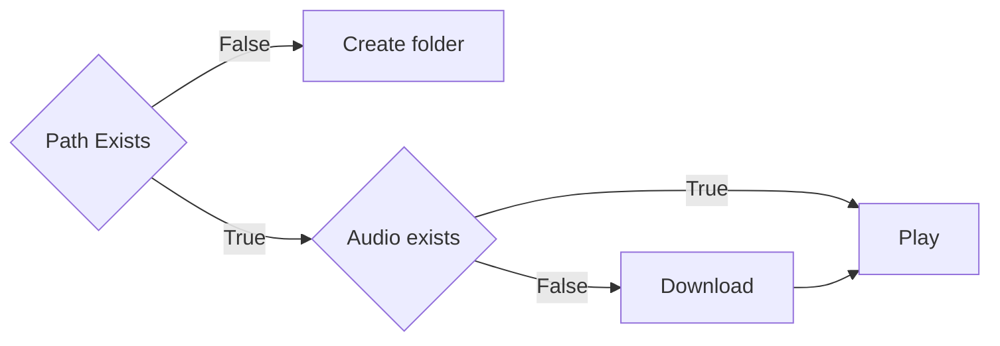

# Sugaroid

## Introduction

Sugaroid is a new Artificial Intelligence which uses Natural Language Processing (NLP) with Machine Learning and neural networks to manipulate user input to provide a intuitive response. The AI is built on Python 3.8 and was built out of personal interest, to tackle three important issues in the Python framework

* Natural Language Processing / Machine Learning
* Graphical User Interface
* Database Management, Configuration file management and Web Development

Sugaroid Chatbot has a comprehensive and modular interface utilizing Object Oriented Programming to benefit activities of [Sugarlabs](www.sugarlabs.org), a non-profit educational organization. The bot aims to understand the comprehensive [documentation](https://en.wikipedia.org/wiki/Documentation) to provide intuitive answers to a user who, may not want to read the entire documentation, or to get a very specific answer

## Installation

The Sugaroid Chatbot is built on [wheels](https://pythonwheels.com/) and is also published on the [Python Packaging Index (PYPI)](pypi.org). This was done, so as to provide easy access to the bot without the end-user undergoing a lot of hassle

```bash
pip3 install sugaroid
```

> NOTE: Users have reported cases when installation was

### Installation from Source

Sugaroid chatbot can also be installed from the latest commits by 

```
pip3 install https://github.com/srevinsaju/sugaroid/archive/master.zip
```

Alternatively

```bash
git clone https://github.com/srevinsaju/sugaroid
cd sugaroid
python3 setup.py install --user
```


## Execution

Running `sugaroid` is easy as pie

Just execute

```bash
$ sugaroid
```

from the Terminal (Linux, Mac OS) and PowerShell (on Windows)

There are few arguments that can be passed to sugaroid

* `qt` : Running `sugaroid qt` will start the `sugaroid` graphical user interface
* `audio` : Running `sugaroid audio` will include audio support for `sugaroid` (Data charges may apply)
* `train`: Running `sugaroid train` will start the sugaroid trainer, which you can use to train sugaroid for some responses 
* `update` : Running `sugaroid update` will clear the current database and train the new data and store it persistently to the configuration path as `sugaroid.db` . (See [Configuration](#Configuraton) for more details)


## Interfaces

### Command Line Interface 

`sugaroid` was initially built to be a command line. This was beneficial for testing an development of new algorithms without calling the GUI every time. A CLI is more familiar to developers. Logging could be manually adjusted to show the verbose outputs. This was implemented within `sugaroid.sugaroid` and could be toggled, by setting 

```python
sugaroid.sugaroid.verbosity = logging.INFO
```

The `INFO` can be replaced to match any of the following `WARNING`, `ERROR` , `INFO`


### Graphical User Interface (Local)


The modular capacity of Sugaroid makes it easy to implement a GUI without rewriting the code. This is highly efficient because it reuses objects and reduces the size of the end distribution. The GUI for sugaroid is built on `LGPL` based open source GUI framework, viz. `PyQt5`. The implemented `PyQt5` framework in `Sugaroid` looks similar to the following image. (Image may vary with updates)

### Django (Web) Interface

In order to provide a server side chatbot server, the sugaroid AI was configured to be used to Django. 


## Configuration

Sugaroid saves some data to your PC. The path where `sugaroid` saves the data is `~/.config/sugaroid` on Linux and Mac OS, but on Windows it is in `C:\Users\<username>\AppData\sugaroid\ ` 

This is the training database used my sugaroid to answer your questions. Particularly related to `sugaroid` brain, the files are `sugaroid.db` and `sugaroid.trainer.json` 

* `sugaroid.db` : The Sugaroid bot uses `SQLite` to read data from a persistent database. Remove `sugaroid.db` will reset `sugaroid`s brain, and a fresh database will be created  from scratch
* `sugaroid.trainer.json` : Is a JavaScript Object Notation file which stores trained responses in order to reset or retrain them whenever there is a necessity. This file may or may not be present in end user's systems and depends solely on the type of release `dev` or `stable`

There might also be additional files in the configuration directory. These are Audio files, In the case that the `audio` keyword is passed as an argument, it creates samples of audio files downloaded from the `Google` server to serve [TTS (Text to Speech)](https://cloud.google.com/text-to-speech) to the end user. 

### TTS Configuration files

The TTS configuration files are created by the `sugaroid.tts.Text2Speech` class. This follows an optimization algorithm. The following is the steps followed by it in short:



This algorithm is implemented to prevent the download of Audio files on each request by the sugaroid bot.