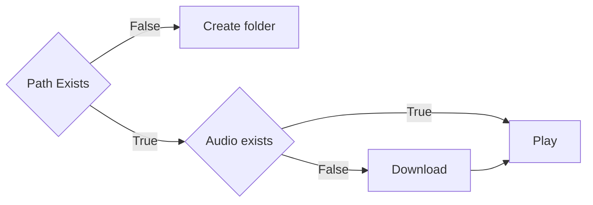

# Sugaroid
[](https://www.patreon.com/srevinsaju?fan_landing=true)

> **IMPORTANT** : Sugaroid is an open source software. The web server is deployed on Microsoft Azure. Your support for this open source software is highly necessary to make this project continued to be served on the world wide web. Consider being my patron to help Sugaroid host its servers or if you are willing to lend servers for Sugaroid, press the sponsor button and email me. Thanks. However, Sugaroid will always remain free forever :smile:

## Introduction

Sugaroid is a new Artificial Intelligence which uses Natural Language Processing (NLP) with Machine Learning and neural networks to manipulate user input to provide a intuitive response. The AI is built on `Python 3.8.2` and was built out of personal interest, to tackle three important issues in the Python framework

* Natural Language Processing / Machine Learning
* Graphical User Interface
* Database Management, Configuration file management and Web Development

Sugaroid Chatbot has a comprehensive and modular interface utilizing Object Oriented Programming to benefit activities of [Sugarlabs](www.sugarlabs.org), a non-profit educational organization. Initially built to serve as a companion bot, the Sugaroid Virtual Assistant helps to comprehend most of the messages, to generate a probable response. The future plans of sugaroid aims to extend Sugaroid as a documentation reader of which beta previews are `still under testing`. 

The Sugaroid bot is deployed in production servers particularly for testing. 

* [The web interface](https://sed.lol/sugaroid)
* The discord bot
* IRC bot hosted on self when necessary

## Installation

### Installing from PYPI

The Sugaroid Chatbot is built on [wheels](https://pythonwheels.com/) and is also published on the [Python Packaging Index (PYPI)](pypi.org). This was done, so as to provide easy access to the bot without the end-user undergoing a lot of hassle

```bash
pip3 install sugaroid
```

> `NOTE`: Users have reported cases when installation was unsuccessful especially if the native operating system  is Windows. The testing on the `Windows` and related operating systems like `ReactOS` is only under progress. If you would like to contribute to windows testing, let me know as an issue on the repository or a mail

### Installation from Source

Sugaroid chatbot can also be installed from the latest commits by 

```
pip3 install https://github.com/srevinsaju/sugaroid/archive/master.zip
```

Alternatively

```bash
git clone https://github.com/srevinsaju/sugaroid
cd sugaroid
python3 setup.py install --user
```


## Execution

Running `sugaroid` is easy as pie

Just execute

```bash
$ sugaroid
```

from the Terminal (Linux, Mac OS) and PowerShell (on Windows)

There are few arguments that can be passed to sugaroid

* `qt` : Running `sugaroid qt` will start the `sugaroid` graphical user interface
* `audio` : Running `sugaroid audio` will include audio support for `sugaroid` (Data charges may apply)
* `train`: Running `sugaroid train` will start the sugaroid trainer, which you can use to train sugaroid for some responses 
* `update` : Running `sugaroid update` will clear the current database and train the new data and store it persistently to the configuration path as `sugaroid.db` . (See [Configuration](#Configuraton) for more details)

To launch the sugaroid web server on any IP address, do a local clone of the package by

```bash
git clone https://github.com/srevinsaju/sugaroid-wsgi --depth=1
cd sugaroid-wsgi
python manage.py runserver
```

Follow the on-screen instructions to get it running on your web browser. If the command completed with a status `OK`, you should be able to see sugaroid running on https://0.0.0.0:8000

## Interfaces

### Command Line Interface 

`sugaroid` was initially built to be a command line. This was beneficial for testing an development of new algorithms without calling the GUI every time. A CLI is more familiar to developers. Logging could be manually adjusted to show the verbose outputs. This was implemented within `sugaroid.sugaroid` and could be toggled, by setting 

```python
sugaroid.sugaroid.verbosity = logging.INFO
```

The `INFO` can be replaced to match any of the following `WARNING`, `ERROR` , `INFO`


### Graphical User Interface (Local)


The modular capacity of Sugaroid makes it easy to implement a GUI without rewriting the code. This is highly efficient because it reuses objects and reduces the size of the end distribution. The GUI for sugaroid is built on `LGPL` based open source GUI framework, viz. `PyQt5`. The implemented `PyQt5` framework in `Sugaroid` looks similar to the following image. (Image may vary with updates)

### Django (Web) Interface

In order to provide a server side chatbot server, the sugaroid AI was configured to be used to Django. This used open source bootstrap templates to create a chatbot appearance that was pretty neat and effective way to host it on a Django server (if one exists)


The current work left on the Django system is to enable cookies to store the data on the client side temporarily and not on the server side. The current Django implementation is based on server-side, which implies the chat history is saved on the server

## Similarity Algorithms

### Jaccard Similarity

Jaccard Similarity / sigma similarity uses a simple, but less memory intensive algorithm to analyze the statements. The equation is given as follows
$$
\theta = \frac {n}{x+y}
$$
Where n, number of common words in list x and list y, and (x+ y) shows the union of x and y similarity. 

The benefits of using Jaccard similarity is that, sugaroid can implement `can_process` methods in an object with optimal resource usage. There is no need to use complex cosine dot product for finding similarity in cases there are only one word as list x and list y respectively. This helped to optimize the sugaroid bot partly

Jaccard Similarity can be accessed by `sugaroid.brain.preprocessors.sigma_similarity`

### Cosine Dot product 

The Sugaroid AI selectively uses Cosine Dot product for comparing statements on the ratio of similarity and selects an appropriate statement stored to the database. 
$$
\vec A.\vec B = ABcos\theta \\
cos \theta = \frac{\vec A . \vec B}{A.B}
$$
Words are classified as vectors in this case. Similar words are given similar but unique vector quantity, such that only equal phrases can have the common cosine dot product. This vector model was downloaded from the universal `nltk.wordnet` is a collection of word and their classification


This complex collection of details helped to club similar nouns and verbs together and provide customized answers, reduce training data and increasing program logic. Therefore, each data was not to be separately forced to the sugaroid bot to understand and learn but also learn the phrases of message input by itself and store it in the SQL Database for future reference

Cosine Dot product can be accessed within sugaroid by `sugaroid.brain.postprocessors.cosine_similarity`

### Jensen Shannon Distance (JSD)

The [Jensen Shannon Distance](https://en.wikipedia.org/wiki/Jensen–Shannon_divergence) is the last and the complex algorithm used inside `sugaroid` bot. The equation for finding Jensen Shannon Distance is not directly used within 
$$
D(M || Q) = \sum M(i) . \log \frac {M(i)}{Q(i)} \\
JSD (M || Q) = \frac 12\sum ( \log(\frac {M(i)}{\frac12M(i) + Q(i)}) + \log(\frac{Q(i)}{\frac 12 M(i) + Q(i)}))
$$
This being a complex and CPU intensive process, is handled systematically by a Natural Language Processing library with Industrial Processing support, viz, SpaCy. The [SpaCy](spacy.io) library handles this effectively by loading data from `en_core_web_sm` and `en_core_web_lg`

The difference between `sm` and `lg` is that, `en_core_web_sm` is collection of all the word in the dictionary with vectors only  and weighs 7.5 MB. The `en_core_web_lg` weighs 880 MB, and has data for `tensors` too. This dataset is more efficient because, the data so obtained has tensor data and this helps to correctly measure Jensen Shannon Distance. 

The JSD is internally implemented in an `nlp` object called `LanguageProcessor` and handles most of the complex conversations inside `sugaroid.brain.utils.LanguageProcessor` is a signed class with two methods `tokenize` and `similarity` The `similarity` method return the resultant net vector displacement of the given vectors.

#### Sentiments Analyzer

The `sugaroid.brain` features another comprehensive object derived from `wordnet` called `SentimentsIntensityAnalyzer` or `sia` for short. The `SentimentIntensityAnanlyzer` has a list of words with positivity, negativity and neutrality. `sugaroid` bot uses `vader_lexicon` to classify sentences as attributive or corruptive and then gives an equal answer.

### Faults in Similarity Algorithms

Sometimes, the similarity algorithms may give a completely incorrect answer that may lead to false response by the bot to the user. This is because tensors have no resultant displacement and has multiple direction. To compute zero vectors, SpaCy uses an approximation algorithm called Word Mover Distance. This might lead to unknown predictions. Such predictions should be raised as an issue on the Sugaroid repository to create a tackler adapter that would override the answer with a suitable confidence value. 

The other complex and efficient algorithms have been neglected. This is to reduce the size of the distribution as well as reduce the time of installation on an end-user's PC. Complex and accurate Natural Language Processing systems like `pytorch` and `tensorflow` exists, but this may result in the net user installation size to be approximately 2 GB +, which is probably not what the end-user requires.

## Configuration

Sugaroid saves some data to your PC. The path where `sugaroid` saves the data is `~/.config/sugaroid` on Linux and Mac OS, but on Windows it is in `C:\Users\<username>\AppData\sugaroid\ ` 

This is the training database used my sugaroid to answer your questions. Particularly related to `sugaroid` brain, the files are `sugaroid.db` and `sugaroid.trainer.json` 

* `sugaroid.db` : The Sugaroid bot uses `SQLite` to read data from a persistent database. Remove `sugaroid.db` will reset `sugaroid`s brain, and a fresh database will be created  from scratch
* `sugaroid.trainer.json` : Is a JavaScript Object Notation file which stores trained responses in order to reset or retrain them whenever there is a necessity. This file may or may not be present in end user's systems and depends solely on the type of release `dev` or `stable`

There might also be additional files in the configuration directory. These are Audio files, In the case that the `audio` keyword is passed as an argument, it creates samples of audio files downloaded from the `Google` server to serve [TTS (Text to Speech)](https://cloud.google.com/text-to-speech) to the end user. 

### TTS Configuration files

The TTS configuration files are created by the `sugaroid.tts.Text2Speech` class. This follows an optimization algorithm. The following is the steps followed by it in short:



This algorithm is implemented to prevent the download of Audio files on each request by the sugaroid bot.


## Memory 

The Sugaroid bot has been designed to provide an acceptable answer and the author had been focusing on refining the response by the bot more and more better. However this has resulted in bad PEP practices and dis allocated memory modules. 

| Time                      | Memory (KB) | Memory (MB) |
| ------------------------- | ----------- | ----------- |
| Initial Loading           | 83500 KB    | 83.5 MB     |
| Pause after loading       | 173800 KB   | 173.8 MB    |
| First Question (Hello)    | 266500 KB   | 266.5 MB    |
| Second Question (Hey)     | 287500 KB   | 287.5 MB    |
| Third Question (Emotion)  | 289500 KB   | 289.5 MB    |
| Fourth Question (Emotion) | 289950 KB   | 290 MB      |

This is because, a lot of unnecessary objects have been created in the memory. This should be removed before the release of `sugaroid` version 1.0

### Update v 0.7

The unnecessary `spaCy` tokenizers were forced to be implemented into a single function called `sugaroid.sugaroid.SugaroidStatement`  which calculates the `spacy.nlp.Doc` on each object initialization. All the rest of the statement tokenizers were replaced by the base class usage. This prevents the recalculation of the similarity and tokens for each adapter. However, the number of adapters have increased considerably. The net memory decrease cannot be plotted, nevertheless. On the addition of each Adapter, the average RAM increases logarithmically as far as 1% of the total RAM used. This increases exponentially until the bases state where the coverage of sugaroid has been achieved to be above 75% and all the adapters have been significantly used to process at least 1 statement.

## CPU Usage

The Sugaroid bot does not have significant CPU usage. Tested on Linux Manjaro running with 1.8 GHz with other applications running did not affect system stability. 

## Adapters

The brain of sugaroid relies in the modules it uses. Sugaroid uses many modules to process statements called `Adapters` to process statements. Each statement is checked against two functions `LogicAdapter.can_process()` and `LogicAdapter.process()`.  `LogicAdapter.can_process()` gives a boolean response if the statement can or cannot be processed. If the statement can be processed, `LogicAdapter.process()` is called. 

As of Sugaroid `v0.7`, it has:

* BoolAdapter: Processes Boolean based answers
* AkinatorAdapter: Adapter which ports the wrapper of the Akinator game to Sugaroid
* HangmanAdapter: Plays hangman with you 
* OrAdapter: Selects a random operand of the provided statement 
* OkayAdapter: Handles statements with a plain old okay 
* ByeAdapter: Destroys Sugaroid on bye 
* TimeAdapter: Provides time and time related functions except time conversion 
* CurrencyAdapter: Gives a random response, because Sugaroid tries not to say I don't know 
* LearnAdapter: a specific adapter for learning responses 
* TriviaAdapter: Plays a short game of trivia 
* WhoAdapter: Handles statements with 'who' as one of the tokens 
* NewsAdapter: Ports the SugaroidNews Wrapper for easier access by the SugaroidChatbot Class 
* JokeAdapter: Gets a random joke from the Chuck Norris Database 
* PlayAdapter: [DEPRECATED] Plays a game on desktops only 
* CanAdapter: Processes statements which features a Modal question (can, may) 
* BecauseAdapter: Processes statements which starts with Because or gives a reason 
* ReReverseAdapter: Processes statements featuring conversational flow. It scans the previous statements 
     and takes a cosine similarity of the statemnts, and TFiD Vector cross product to get 
     the most probable answer 
* ReverseAdapter: A random adapter. Top Secret 
* MyNameAdapter: Handles sentences featuring 'my' and 'name' 
* MeAdapter: Processes the statements showing possessive 
* AboutAdapter: Defines the personality of sugaroid 
* WikiAdapter: Handles Wikipedia based questions 
   DoLikeAdapter: Handles likes of Sugaroid 
   FeelAdapter: Handles sentences containing the word feel 
   DoLikeAdapter: Handles likes of Sugaroid 
   DoAdapter: Processes statements beginning with 'Do' and 'know' 
   EmotionAdapter: Handles positive and negative emotional statements 
   DisAdapter: A complex algorithm sorting the words beginning with negative based on the probability. 
     and achieving a similar confidence ratio of the word percentage. 
     The DisAdapter keeps the confidence below 0.5 so that the BestAdapter may find some 
     other answer similar to 
   TwoWordAdapter: Hanfles sentences having two wrods 
   OneWordAdapter: Logical adapter for processing data with one words 
   DebugAdapter: Internal Admin feature to debug Sugaroid statements 
   WhyWhenAdapter: Processes wh-adverbs 
   ReaderAdapter: Logical adapter for processing data with one words 
   ImitateAdapter: Handles statements involving imitations of some sentences 
   FunAdapter: Gives a random response, because Sugaroid tries not to say I don't know 
   UnitConversion: The UnitConversion logic adapter parse inputs to convert values
