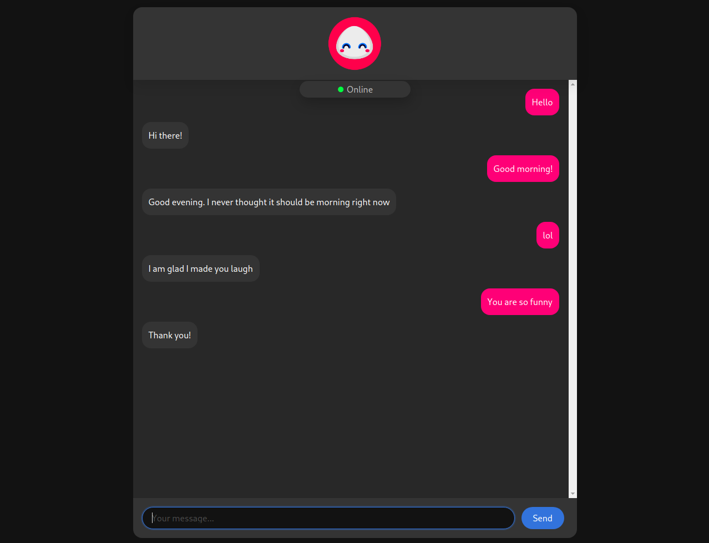

# Flask Backend

Sugaroid Core Backend is built on the simple and powerful [Flask](https://flask.palletsprojects.com/en/1.1.x/tutorial/layout/) Web Server powered by `gunicorn` on 4 threads run on another dedicated Heroku Server and Microsoft Azure Server. 

Sugaroid Flask server runs a single instance of Sugaroid on the server, and then processes user information to and fro from the server. This takes places by passing the user's message (initiator) as a URL parameter. Users information, is not encrypted from both sides however as this is an educational project, but could be added as an extended feature in the future. A `POST` request is sent to the backend with the user's message as query parameter `?usermsg=Hello+World` and along with that, a `Content-Type/json`data blob with data in three keys. 

```json
{
    "message": "<message from the bot here>",
    "emotion": <int emote number corresponding sugaroid.brain.constants.Emotion>,
    "data": "FJAASJFjjASFHASAS+DKKDDUERJFdhOwdwdhff+dawfhpJFED"
}
```

The `data` field is used by the Sugaroid Bot in getting the message context (_see context_) and providing an appropriate reply. This helps to keep per user configuration on the client side and hence easing out the burden on the server and helps to serve requests faster. This is beneficial as it helps to asynchronously serve data but at the same time might not be intuitive to users as, a delay in request could create overlapping messages which would not be delivered at the right time. 

The data is decoded on the server side. `sugaroid.chatbot.globals` is reset-ed with the new context and the new message is produced and the same, modified context is resent back to the user / client. Client decodes the context and extracts the response of the Unicode string from the server and appends to the User Interface. The other data is publicly maintained in a [JavaScript](https://www.javascript.com) variable and then, will be resent to the server on the next user message. This process happens asynchronously on the client side using `JQuery` , AJAX `POST` and `GET` requests with callback handlers,



