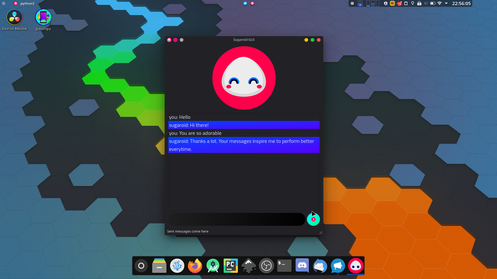

## Graphical User Interface

Graphical User Interface, built on top of `PyQt5`, by Riverbank Computing is used for building sugaroid Graphical User Interface which works on threading and shows emotions corresponding to the statement. Using GUI makes sugaroid more alive and user friendly at the cost of a few more MB of Memory. PyQt5 is a popular library which is compatible with more than 90% of Operating Systems, and for x86 and x64 Processors. (`arm` is still under development, let me know if you had any luck in running sugaroid on `arm`)

