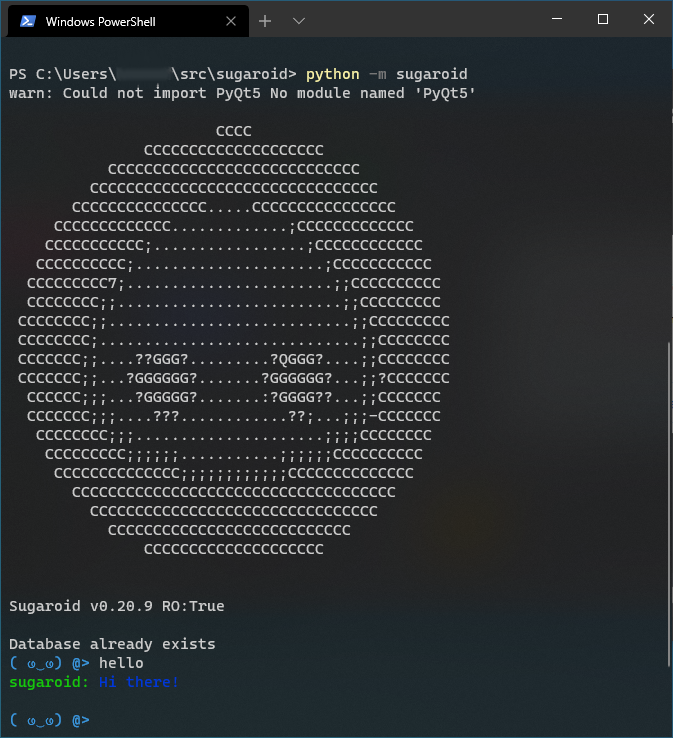

Command Line Interface
----------------------

Command Line Interface is popular among developers and for those systems
with very low memory (< 1024 MB). By default invoking sugaroid
entrypoint triggers the command line interface. You are likely to be
greeted with an ASCII image of Sugaroid (forgive me Windows Users, I am
not interested in developing a ASCII colored image of Sugaroid)

.. figure:: ../img/sugaroid_console.png
   :alt: Command Line Interface of Sugaroid on Linux

   Command Line Interface of Sugaroid on Linux

   Command Line Interface of Sugaroid on Windows
